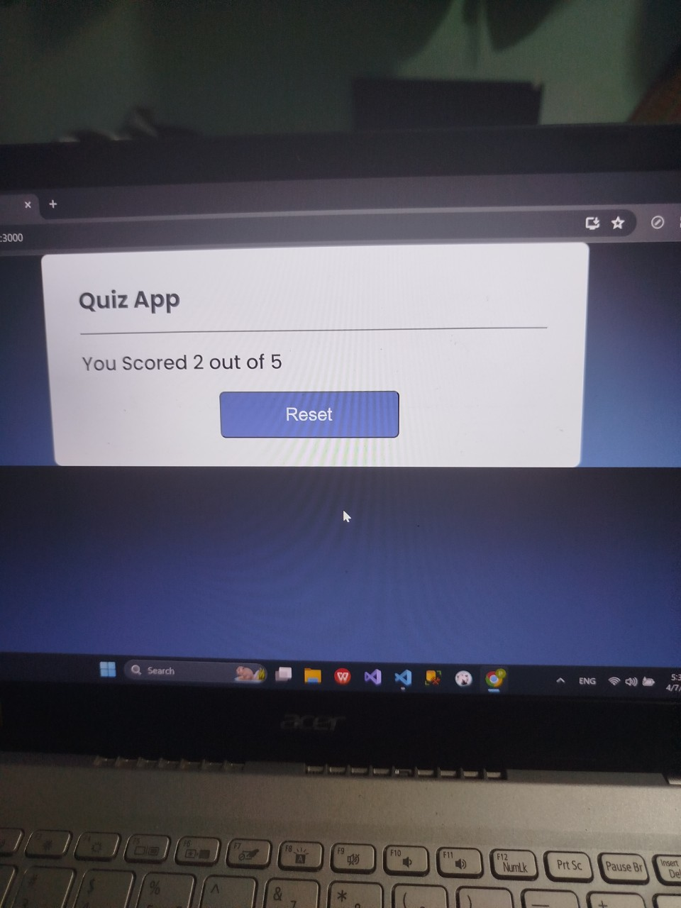
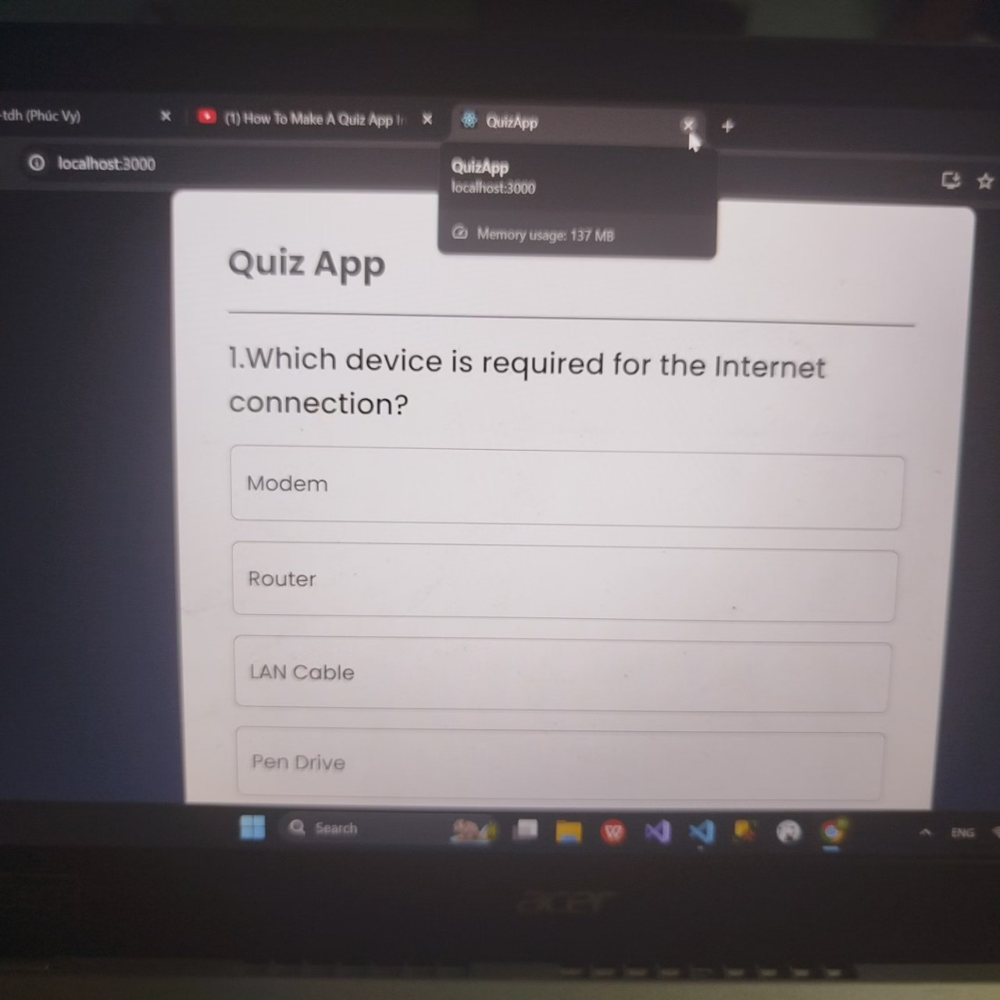
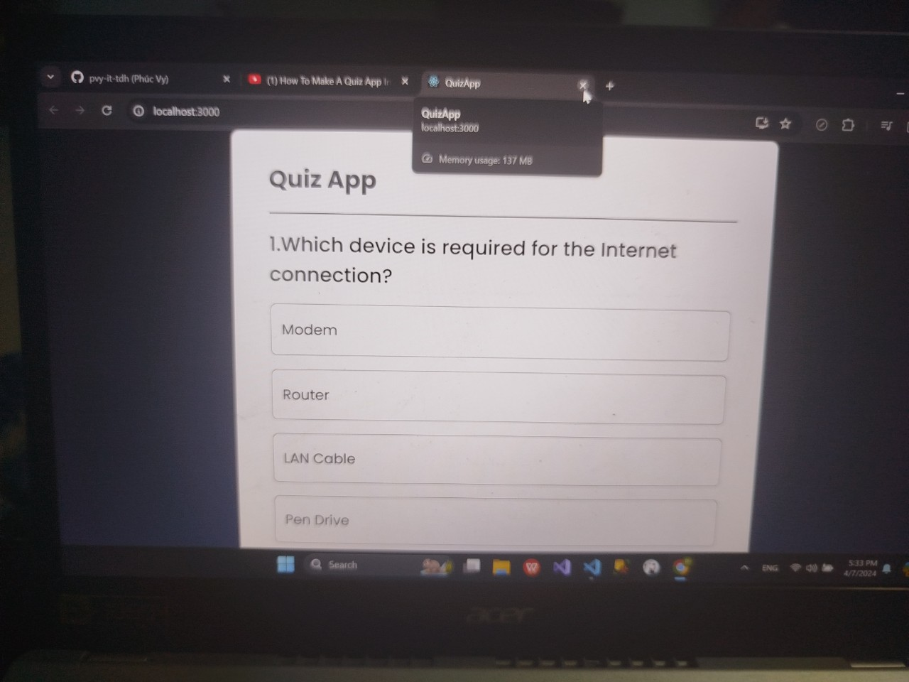

# Quiz App

Công nghệ sử dụng: React

### Ưu điểm 
1. App đơn giản dễ dùng 
2. Tính năng khá là oke

### Nhược điểm
1. Giao diện khá đơn giản 
2. Nên làm thêm tính năng cho người dùng tự nhập data
3. Không sử dụng Responsive
4. Nên tích hợp BE vào sử dụng database để lưu trữ data


### Data

Các bạn có thể chỉnh sửa data rồi dùng 
``` js
export const data = [
    {
      question: "Which device is required for the Internet connection?",
      option1: "Modem",
      option2: "Router",
      option3: "LAN Cable",
      option4: "Pen Drive",
      ans: 1,
    },
    {
      question: "Which continent has the highest number of countries?",
      option1: "Asia",
      option2: "Europe",
      option3: "North America",
      option4: "Africa",
      ans: 4,
    },
    {
      question: "Junk e-mail is also called?",
      option1: "Spam",
      option2: "Fake",
      option3: "Archived",
      option4: "Bin",
      ans: 1,
    },
    {
      question: "A computer cannot BOOT if it does not have the?",
      option1: "Application Software",
      option2: "Internet",
      option3: "Operating System",
      option4: "Mouse",
      ans: 3,
    },
    {
      question: "First page of Website is termed as?",
      option1: "Index Page",
      option2: "Homepage",
      option3: "Sitemap",
      option4: "Pen Drive",
      ans: 2,
    },
  ];
  ```



)

### Một chút tâm sự
App chưa được hoàn thiện cho lắm một phần tui thường làm BE nhiều hơn FE một phần tui cũng mới học React thui nên làm cũng chưa được hoàn hảo lắm và một phần tui cũng không có nhiều thời gian để làm dự án này trong tương lai gần tui sẽ phát triển app một các hoàn thiện nhất có thể